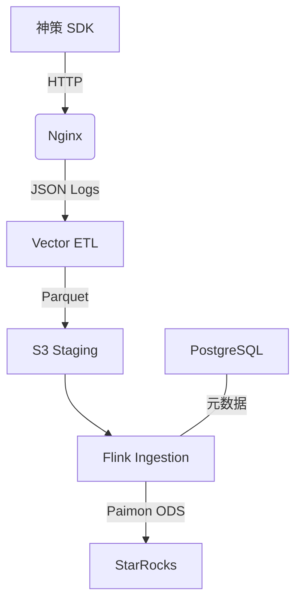

# Lakehouse-track：埋点全链路（Paimon JDBC）

神策埋点 + Vector + Paimon JDBC + StarRocks，实现生产级埋点 Lakehouse 架构。

- **埋点链路**：Vector + Paimon JDBC + StarRocks，针对神策 SDK 深度适配
- **元数据**：PostgreSQL（Paimon JDBC + StreamPark 共用）

---

## 一、架构总览

### 1.1 埋点链路



### 1.2 组件清单

| 组件 | 版本 | 说明 |
|------|------|------|
| Flink | 1.18.1 | 流批一体 |
| Paimon | 0.9.0 | JDBC 模式 |
| StarRocks | 3.2.6 FE+CN | 存算分离，数据存 MinIO |
| PostgreSQL | 16 | Paimon JDBC + StreamPark 元数据 |
| Vector | 0.35+ | 采集端 ETL |
| Kafka | 3.7.0 | 消息队列（可选 profile） |

---

## 二、快速开始

### 2.1 前置要求

- **Memory**：至少 12GB（建议 16GB+）
- **CPU**：至少 4 核
- **Disk**：至少 60GB

### 2.2 依赖准备

```bash
# 下载 Flink 依赖 JAR 到 flink_lib/
bash scripts/download-jars.sh

# GeoLite2-City.mmdb 放入 nginx-vector/geoip/（必填，否则 Vector 无法启动）
# 参见 nginx-vector/geoip/README.md
```

### 2.3 启动服务

```bash
# 基础服务（埋点链路）
docker compose up -d --build

# 创建 MinIO bucket: paimon-lake （http://localhost:9001）
# StarRocks 存算分离复用该 bucket，数据存于 paimon-lake/
# 若 app 启动失败，可能是 MinIO 未就绪，app 配置了 restart: on-failure 会自动重试
```

### 2.4 StreamPark 启动（可选）

StreamPark 需挂载 Flink 发行版：

```bash
# 1. 先启动 Flink
docker compose up -d flink-jobmanager flink-taskmanager

# 2. 拷出 Flink 包
mkdir -p flink_dist/flink
docker cp $(docker compose ps -q flink-jobmanager):/opt/flink/. flink_dist/flink/

# 3. 启动 StreamPark（元数据复用 PostgreSQL）
docker compose --profile streampark up -d streampark
```

访问 StreamPark：http://localhost:10000（admin / streampark）

**仅首次部署**：若 PostgreSQL 已有数据，需手动创建 streampark 库：
```bash
docker compose exec postgres psql -U paimon -d paimon_db -c "CREATE DATABASE streampark;"
```

---

## 三、埋点链路配置（Paimon JDBC）

### 3.1 Flink 入湖

```bash
docker compose exec flink-jobmanager ./bin/sql-client.sh
```

按顺序执行 `sql/flink/`：

1. `01-catalog.sql` — Paimon JDBC Catalog
2. `02-paimon-tables.sql` — 创建表
3. `03-ingestion.sql` — 入湖任务

### 3.2 StarRocks 分析

StarRocks 采用存算分离架构（[参考文档](https://docs.starrocks.io/docs/3.2/quick_start/shared-data/)），FE+CN 模式，数据存储在 MinIO。

```bash
# 连接 StarRocks（通过 FE）
mysql -h 127.0.0.1 -P 9030 -u root
```

执行 `sql/starrocks/`：`01-external-catalog.sql`、`02-views-mvs.sql`

**提示**：若 Stream Load 报错 URL 含 `starrocks-cn`，需在 `/etc/hosts` 添加 `127.0.0.1 starrocks-cn` 以便从本机访问错误日志。

### 3.3 验证埋点

```bash
# 验证前需将 distinct_id 加入 Redis 白名单（CORE 事件）
redis-cli SET user_whitelist:888 1

curl -X GET "http://localhost/sa?data=eyJkaXN0aW5jdF9pZCI6Ijg4OCIsImV2ZW50IjoiVmlld1Byb2R1Y3QiLCJ0eXBlIjoidHJhY2siLCJwcm9wZXJ0Ijp7InByaWNlIjoxMDB9LCJ0aW1lIjoxNzA3MTgwMDAwMDAwfQ=="
```

---

## 四、CDC 与进阶能力

### 4.1 MySQL CDC 入湖

下载 MySQL CDC Connector 放入 `flink_lib/`：

```bash
curl -o flink_lib/flink-sql-connector-mysql-cdc-3.0.1.jar \
  https://repo1.maven.org/maven2/com/ververica/flink-sql-connector-mysql-cdc/3.0.1/flink-sql-connector-mysql-cdc-3.0.1.jar
```

在 StreamPark 中配置 `mysql-cdc` 连接 MySQL 业务库，同步至 Paimon。

### 4.2 性能调优

- **Bucket**：`'bucket' = '-1'` 动态分桶
- **Checkpoint**：1–3 分钟，Exactly Once
- **Savepoint**：`'sink.savepoint.enabled' = 'true'` 断点续传

### 4.3 Compaction

```bash
docker compose exec flink-jobmanager ./bin/flink run \
  -c org.apache.paimon.flink.action.CompactAction /opt/flink/lib/paimon-flink-1.18-0.9.0.jar \
  --warehouse s3://paimon-lake/data/ \
  --database default \
  --table ods_events_core
```

---

## 五、常见地址

| 服务 | 地址 |
|------|------|
| Flink Web UI | http://localhost:8081 |
| MinIO 控制台 | http://localhost:9001 |
| StreamPark | http://localhost:10000 |
| StarRocks FE | mysql -h 127.0.0.1 -P 9030 -u root |
| PostgreSQL | psql -h 127.0.0.1 -U paimon -d paimon_db (或 streampark) |
| Kafka | localhost:9092（需 `--profile kafka` 启动） |

---

## 六、目录结构

```
.
├── configs/           # 按服务分类的配置
│   ├── flink/         # Flink 集群
│   ├── postgres/      # PostgreSQL 初始化
│   └── starrocks/     # StarRocks 存算分离
├── sql/               # 按执行环境分类的 SQL
│   ├── flink/         # Flink SQL Client 执行
│   └── starrocks/     # StarRocks 执行
├── flink_lib/         # Flink 依赖 JAR（scripts/download-jars.sh）
├── flink_dist/        # StreamPark 挂载的 Flink（运行时生成）
├── nginx-vector/      # 采集端
├── scripts/           # 工具脚本
├── deploy/k8s/        # K8s 部署（可选）
└── docker-compose.yml
```

---

*文档版本：2026-02（Paimon JDBC 模式）*
