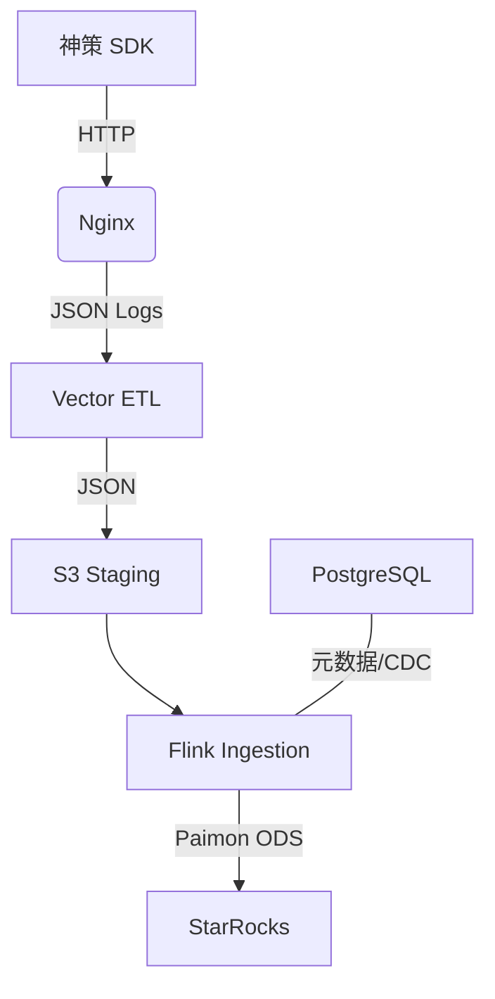

# Lakehouse-track：埋点全链路 Lakehouse 架构

神策埋点 + Vector + Paimon + StarRocks，实现生产级埋点 Lakehouse 架构。

- **埋点链路**：Nginx → Vector → MinIO → Flink → Paimon → StarRocks
- **元数据**：PostgreSQL（StreamPark 共用）；Paimon 使用 **Hive Metastore**
- **存储**：MinIO (S3 兼容) 承载 Paimon ODS 层与 StarRocks 存算分离数据

---

## 快速开始（TL;DR）

```bash
bash scripts/lakehouse.sh install          # 1. 安装依赖 (JAR, GeoIP)
docker compose up -d --build                # 2. 启动所有服务 (含 MinIO 自动初始化)
./scripts/lakehouse.sh run-sql              # 3. 提交 Flink 任务与 StarRocks 视图
./scripts/lakehouse.sh verify               # 4. 发送测试数据并验证链路
```

---

## 一、架构总览

### 1.1 数据流


### 1.2 组件清单
| 组件 | 版本 | 说明 |
|------|------|------|
| Flink | 1.20.3 | 流批一体（生态最稳版本线），支持 SQL Statement Set |
| Paimon | 1.3.1 | Hive Metastore，元数据集中管理，数据存 MinIO |
| StarRocks | 3.5.12 | 存算分离模式（JDK17+），支持 Paimon External Catalog |
| PostgreSQL | 16 | StreamPark 元数据 + CDC 源表 |
| Vector | 0.53+ | 采集端，负责日志解析、GeoIP 增强与 S3 写入 |
| MinIO | latest | 统一存储层 |

---

## 二、部署指南

### 2.1 资源要求
| 资源 | 最小配置 | 推荐配置 |
|------|------|------|
| 内存 | 12GB+ | 16GB+ |
| CPU | 4 核 | 8 核+ |
| 磁盘 | 60GB SSD | 100GB+ |

> **注意**：
> 1. **内存分配**：StarRocks FE/CN 已配置为各 4GB 内存以保证 OLAP 查询稳定性，Flink 占用约 4GB，整体建议宿主机预留至少 12GB 内存。
> 2. **Docker 限制**：请确保 Docker Desktop / Colima 的内存限制已调至 12GB 以上，否则 StarRocks 容器极易因 OOM 退出。

### 2.2 架构优化说明 (2026-02-08 更新)
基于大数据专家评审，本项目已完成以下优化：
- **存储优化**：Paimon（1.3.1）表格式使用 `parquet`，压缩采用 `zstd`；Vector 批处理调整为 60s/1000条，大幅减少 S3 小文件数量。
- **StarRocks 升级 (3.5.12)**：采用 3.5.x 最新 patch（**JDK 17+**），并按官方升级说明为外部 Catalog 增加 JVM `--add-opens`。
- **Paimon (1.3.1)**：采用 Paimon 最新稳定版（2025-11-27 发布），与 Flink 1.20.3/StarRocks 外部 Catalog 生态配套更完善。
- **稳定性增强**：StarRocks 内存上调至 4GB，并优化了 Healthcheck 逻辑；FE 增加了元数据缓存限制（20%）和慢查询监控（1000ms），确保集群长期运行不宕机。
- **存算分离优化**：StarRocks 采用 `shared_data` 模式，数据全量上云（MinIO），本地开启了 **Data Cache**（挂载至 `./data/starrocks/cn/datacache`）以加速热数据读取。
- **配置幂等性**：优化了 StarRocks 启动脚本，支持幂等添加 CN 节点，避免重复启动时的 SQL 报错；Healthcheck 逻辑更加精准。
- **资源隔离**：JAR 包依赖通过 `paimon-ext` 专用目录隔离加载，彻底解决类冲突风险。

> **升级提示（重要）**：从 Paimon 0.8.x 升级到 0.9.x 时，建议清理 MinIO 中旧的 `paimon_data`（或直接执行 `./scripts/lakehouse.sh reset`）后再重建，避免残留元数据导致 Catalog/表不可见。

### 2.3 目录结构
```text
.
├── data/               # [统一数据目录] 包含 PG, MinIO, StarRocks, Logs 等
├── scripts/            # [脚本中心] lakehouse.sh 统一入口
├── flink/              # [Flink] Dockerfile, flink.sql, 配置文件
├── starrocks/          # [StarRocks] SQL 脚本, 共享配置, 依赖 JAR
├── vector/             # [Vector] 采集配置, GeoIP 数据库
├── nginx/              # [Nginx] 采集端配置
├── postgres/           # [PostgreSQL] 初始化 SQL (StreamPark + CDC)
└── deploy/             # [部署] K8s 部署文件 (Kustomize)
```

### 2.3 核心脚本：lakehouse.sh
`./scripts/lakehouse.sh` 是项目的唯一操作入口：
- `install`: 一键下载所有 JAR 依赖和 GeoIP 数据库。
- `run-sql`: 自动执行 Flink 入湖任务和 StarRocks 视图创建。
- `fix`: 针对 Flink 资源不足或连接异常的一键修复。
- `verify`: 发送测试埋点并自动检查全链路状态。
- `reset`: 清空所有数据并重新初始化整个环境。

---

## 三、使用指南

### 3.1 首次启动步骤
1. **安装依赖**：`bash scripts/lakehouse.sh install`（含 Hive Metastore 客户端依赖）
2. **启动容器**：`docker compose up -d --build`
3. **初始化存储**：访问 [MinIO](http://localhost:9001) (minioadmin/minioadmin) 创建 bucket `Lakehouse`。
4. **提交任务**：`./scripts/lakehouse.sh run-sql`（如在宿主机直连 HMS：`HMS_URI=thrift://127.0.0.1:9083 ./scripts/lakehouse.sh run-sql`）

### 3.2 验证埋点链路 (Tracking)
执行验证脚本：
```bash
./scripts/lakehouse.sh verify
```
该脚本会：
1. 发送一条测试埋点数据。
2. 检查 Nginx 日志、Vector 落地、Flink 任务状态。
3. 等待数据入湖后，提示可在 StarRocks 中查询。

### 3.3 验证 CDC 链路
该链路验证 PostgreSQL 数据库变更实时同步至 Lakehouse：

1. **修改 PostgreSQL 数据**：
   ```bash
   docker compose exec -T postgres psql -U paimon -d paimon_db -c \
   "INSERT INTO cdc_test_orders (order_id, user_id, amount) VALUES ('o3', 'u3', 299.00);"
   ```

2. **检查 StarRocks 结果**：
   ```sql
   -- 约 10-20 秒后查询
   SELECT * FROM paimon_catalog.`default`.ods_orders_cdc WHERE order_id = 'o3';
   ```

3. **验证更新同步**：
   ```bash
   docker compose exec -T postgres psql -U paimon -d paimon_db -c \
   "UPDATE cdc_test_orders SET amount = 300.00 WHERE order_id = 'o3';"
   ```
   再次在 StarRocks 中查询，确认 `amount` 已变为 `300.00`。

### 3.4 StarRocks 查询
```bash
mysql -h 127.0.0.1 -P 9030 -u root
# 查询实时入湖数据
SELECT * FROM paimon_catalog.`default`.ods_events_core;
```

---

## 四、常见问题 (FAQ)

| 问题 | 原因与解决方法 |
|------|------|
| **Flink 资源不足** | 报错 `NoResourceAvailableException`。项目已调优内存，请确保 Docker 内存限制 ≥ 8GB。 |
| **StarRocks Catalog 已存在** | 脚本已修复 DROP 顺序。若仍报错，可执行 `./scripts/lakehouse.sh run-sql starrocks` 强制重刷。 |
| **Paimon 查询报错 (InvalidClassException)** | 典型原因是 **Flink/Paimon/StarRocks** 三端 JAR 版本不一致导致的类冲突。当前推荐版本线为：Flink **1.20.3** + Paimon **1.3.1** + StarRocks **3.5.12**（并确保 StarRocks 外部 Catalog 所需 JAR 由 `scripts/lakehouse.sh install` 下载）。 |
| **Vector 无法写入 MinIO** | 检查 `Lakehouse` bucket 是否已创建。创建后需 `docker compose restart vector`。 |
| **Flink 任务 RESTARTING** | 通常是 S3 连接超时或 JAR 缺失。执行 `./scripts/lakehouse.sh fix` 自动重置任务。 |
| **完全重置环境** | 执行 `./scripts/lakehouse.sh reset`。**注意：这将删除所有历史数据！** |

---

## 五、常用地址
- **Flink Web UI**: [http://localhost:8081](http://localhost:8081)
- **MinIO Console**: [http://localhost:9001](http://localhost:9001)
- **StarRocks FE**: `127.0.0.1:9030` (MySQL 协议)
- **PostgreSQL**: `127.0.0.1:5432` (paimon/paimon123)

---
*更新于：2026-02-07*
