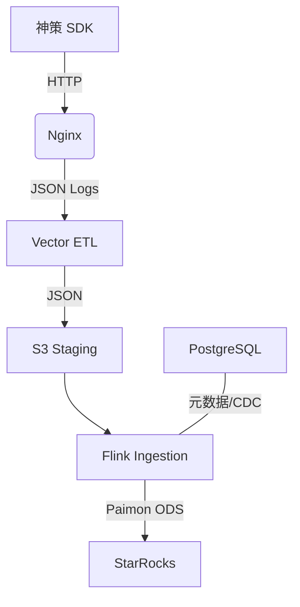

# Lakehouse-track：埋点全链路 Lakehouse 架构

神策埋点 + Vector + Paimon + StarRocks，实现生产级埋点 Lakehouse 架构。

- **埋点链路**：Nginx → Vector → MinIO → Flink → Paimon → StarRocks
- **元数据**：PostgreSQL（StreamPark 共用）；Paimon 使用 **filesystem metastore**
- **存储**：MinIO (S3 兼容) 承载 Paimon ODS 层与 StarRocks 存算分离数据

---

## 快速开始（TL;DR）

```bash
bash scripts/lakehouse.sh install          # 1. 安装依赖 (JAR, GeoIP)
docker compose up -d --build                # 2. 启动所有服务
# 3. 在 MinIO 控制台 http://localhost:9001 创建 bucket: paimon-lake
./scripts/lakehouse.sh run-sql              # 4. 提交 Flink 任务与 StarRocks 视图
./scripts/lakehouse.sh verify               # 5. 发送测试数据并验证链路
```

---

## 一、架构总览

### 1.1 数据流


### 1.2 组件清单
| 组件 | 版本 | 说明 |
|------|------|------|
| Flink | 1.18.1 | 流批一体，使用 STATEMENT SET 合并提交任务 |
| Paimon | 0.9.0 | filesystem metastore，元数据与数据均存 warehouse |
| StarRocks | 3.2.6 | 存算分离模式，支持 Paimon External Catalog |
| PostgreSQL | 16 | StreamPark 元数据 + CDC 源表 |
| Vector | 0.53+ | 采集端，负责日志解析、GeoIP 增强与 S3 写入 |
| MinIO | latest | 统一存储层 |

---

## 二、部署指南

### 2.1 资源要求
| 资源 | 最小配置 | 推荐配置 |
|------|------|------|
| 内存 | 8GB | 16GB+ |
| CPU | 2 核 | 4 核+ |
| 磁盘 | 60GB SSD | 100GB+ |

> **注意**：Flink 已配置为最小资源模式，若任务启动失败，请检查 Docker 分配的总内存。

### 2.2 目录结构
```text
.
├── data/               # [统一数据目录] 包含 PG, MinIO, StarRocks, Logs 等
├── scripts/            # [脚本中心] lakehouse.sh 统一入口
├── flink/              # [Flink] Dockerfile, flink.sql, 配置文件
├── starrocks/          # [StarRocks] SQL 脚本, 共享配置, 依赖 JAR
├── vector/             # [Vector] 采集配置, GeoIP 数据库
├── nginx/              # [Nginx] 采集端配置
├── postgres/           # [PostgreSQL] 初始化 SQL (StreamPark + CDC)
└── deploy/             # [部署] K8s 部署文件 (Kustomize)
```

### 2.3 核心脚本：lakehouse.sh
`./scripts/lakehouse.sh` 是项目的唯一操作入口：
- `install`: 一键下载所有 JAR 依赖和 GeoIP 数据库。
- `run-sql`: 自动执行 Flink 入湖任务和 StarRocks 视图创建。
- `fix`: 针对 Flink 资源不足或连接异常的一键修复。
- `verify`: 发送测试埋点并自动检查全链路状态。
- `reset`: 清空所有数据并重新初始化整个环境。

---

## 三、使用指南

### 3.1 首次启动步骤
1. **安装依赖**：`bash scripts/lakehouse.sh install`
2. **启动容器**：`docker compose up -d --build`
3. **初始化存储**：访问 [MinIO](http://localhost:9001) (minioadmin/minioadmin) 创建 bucket `paimon-lake`。
4. **提交任务**：`./scripts/lakehouse.sh run-sql`

### 3.2 验证链路
执行验证脚本：
```bash
./scripts/lakehouse.sh verify
```
该脚本会：
1. 发送一条测试埋点数据。
2. 检查 Nginx 日志、Vector 落地、Flink 任务状态。
3. 等待数据入湖后，提示可在 StarRocks 中查询。

### 3.3 StarRocks 查询
```bash
mysql -h 127.0.0.1 -P 9030 -u root
# 查询实时入湖数据
SELECT * FROM paimon_catalog.default.ods_events_core;
```

---

## 四、常见问题 (FAQ)

| 问题 | 原因与解决方法 |
|------|------|
| **Flink 资源不足** | 报错 `NoResourceAvailableException`。项目已调优内存，请确保 Docker 内存限制 ≥ 8GB。 |
| **StarRocks Catalog 已存在** | 脚本已修复 DROP 顺序。若仍报错，可执行 `./scripts/lakehouse.sh run-sql starrocks` 强制重刷。 |
| **Vector 无法写入 MinIO** | 检查 `paimon-lake` bucket 是否已创建。创建后需 `docker compose restart vector`。 |
| **Flink 任务 RESTARTING** | 通常是 S3 连接超时或 JAR 缺失。执行 `./scripts/lakehouse.sh fix` 自动重置任务。 |
| **完全重置环境** | 执行 `./scripts/lakehouse.sh reset`。**注意：这将删除所有历史数据！** |

---

## 五、常用地址
- **Flink Web UI**: [http://localhost:8081](http://localhost:8081)
- **MinIO Console**: [http://localhost:9001](http://localhost:9001)
- **StarRocks FE**: `127.0.0.1:9030` (MySQL 协议)
- **PostgreSQL**: `127.0.0.1:5432` (paimon/paimon123)

---
*更新于：2026-02-07*
