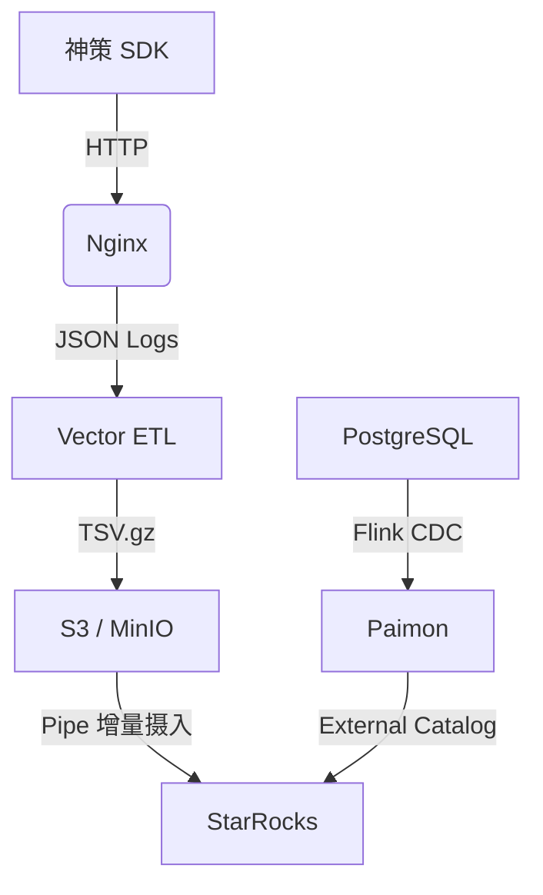

# Lakehouse-track：埋点全链路 Lakehouse 架构

神策埋点 + Vector + Paimon + StarRocks，实现生产级埋点 Lakehouse 架构。

- **埋点链路**：SDK → Nginx → Vector → S3 (TSV.gz) → StarRocks Pipe
- **CDC 链路**：PostgreSQL → Flink CDC → Paimon → StarRocks Paimon Catalog
- **数仓建模**：本仓独立 SQLMesh（`projects/warehouse`，不合并 platform）
- **元数据**：PostgreSQL（业务元数据 + Hive Metastore 后端）
- **存储**：MinIO (S3 兼容) 承载 Paimon 数据与 StarRocks 存算分离数据

---

## 快速开始（TL;DR）

```bash
cp .env.example .env                        # 可选：按需修改环境变量（不复制则用默认值）
make install                                # 1. 安装依赖 (JAR, GeoIP)
docker compose up -d --build                # 2. 启动所有服务 (含 MinIO 自动初始化)
make run-sql                                # 3. 提交 Flink 任务与 StarRocks 视图
make verify                                 # 4. 发送测试数据并验证链路
```

---

## 一、架构总览

### 1.1 数据流

```mermaid
graph TD
    A[神策 SDK] -->|HTTP| B(Nginx)
    B -->|JSON Logs| C[Vector ETL]
    C -->|TSV.gz| D[S3 / MinIO]
    D -->|Pipe 增量摄入| G[StarRocks]
    F[PostgreSQL] -->|Flink CDC| E[Paimon]
    E -->|External Catalog| G
```

### 1.2 组件清单
| 组件 | 版本 | 说明 |
|------|------|------|
| Flink | 1.20.3 | CDC 入湖引擎，PostgreSQL → Paimon |
| Paimon | 1.3.1 | Hive Metastore 管理元数据，数据存 MinIO |
| StarRocks | 3.5.12 | 存算分离模式（JDK17+），支持 Paimon External Catalog |
| PostgreSQL | 16 | 业务元数据 + CDC 源表 |
| Vector | 0.53.0 | 采集端，负责日志解析、GeoIP 增强与 S3 写入 |
| MinIO | latest | 统一对象存储层 |

---

## 二、部署指南

### 2.1 资源要求
| 资源 | 最小配置 | 推荐配置 |
|------|------|------|
| 内存 | 12GB+ | 16GB+ |
| CPU | 4 核 | 8 核+ |
| 磁盘 | 60GB SSD | 100GB+ |

> **注意**：
> 1. **内存分配**：StarRocks FE/CN 各 4GB + Flink 约 4GB，整体建议宿主机预留至少 12GB 内存。
> 2. **Docker 限制**：请确保 Docker Desktop / Colima 的内存限制已调至 12GB 以上，否则 StarRocks 容器极易因 OOM 退出。

### 2.2 目录结构
```text
.
├── services/           # 各组件 Dockerfile、配置文件
│   ├── collection/     #   采集节点 (Nginx + Vector + MetaAPI + MetaSync)
│   ├── flink/          #   Flink CDC, flink.sql, 依赖 JAR
│   ├── hive/           #   Hive Metastore 配置
│   ├── meta-api/       #   元数据注册 API 源码 (内嵌到 collection 容器运行)
│   ├── postgres/       #   PostgreSQL 初始化 SQL
│   └── starrocks/      #   StarRocks SQL 脚本, 共享配置, 依赖 JAR
├── data/               # 运行时数据（PG, MinIO, StarRocks 等，已 gitignore）
├── scripts/            # 被 Makefile 调用的自动化脚本
└── deploy/             # K8s 部署文件 (Kustomize)
```

### 2.3 统一入口：Makefile
在项目根目录执行 `make` 或 `make help` 查看所有目标。常用目标：
- `make install`: 一键下载所有 JAR 依赖和 GeoIP 数据库。
- `make run-sql`: 执行 Flink 入湖任务和 StarRocks DDL（`make run-sql ARGS=flink` 仅执行 Flink）。
- `make fix`: 针对 Flink 资源不足或连接异常的一键修复。
- `make verify`: 发送测试埋点并自动检查全链路状态。
- `make reset`: 清空所有数据并重新初始化整个环境。
- `make replay`: 重放 test_data 中的神策日志。
- `make sqlmesh-install` / `sqlmesh-info` / `sqlmesh-ui`: 本仓 SQLMesh（见 `services/sqlmesh/README.md`）。

### 2.4 SQLMesh（可选）

```bash
make sqlmesh-install && make sqlmesh-info   # CLI → 连 127.0.0.1:9030
make sqlmesh-ui                            # http://127.0.0.1:8082
# 或：docker compose --profile sqlmesh up -d --build sqlmesh
```

项目目录：`projects/warehouse/`（示例模型 `demo.hello`）。状态库默认 DuckDB（`data/sqlmesh_state.db`）。

---

## 三、使用指南

### 3.1 首次启动步骤
1. **安装依赖**：`make install`（含 Flink/Hive/StarRocks JAR 及 GeoIP 数据库）
2. **启动容器**：`docker compose up -d --build`（MinIO bucket 由 `minio-init` 自动创建）
3. **提交任务**：`make run-sql`

### 3.2 验证埋点链路 (Tracking)
```bash
make verify
```
该脚本会发送测试埋点数据，检查 Nginx 日志、S3 落地、Pipe 状态及 StarRocks 数据行数。

### 3.3 验证 CDC 链路
该链路验证 PostgreSQL 数据库变更实时同步至 Lakehouse：

1. **插入测试数据**：
   ```bash
   docker compose exec -T postgres psql -U postgres -d postgres -c \
   "SET search_path TO cdc_test; INSERT INTO cdc_test_orders (order_id, user_id, amount) VALUES ('o3', 'u3', 299.00);"
   ```

2. **检查 StarRocks 结果**（约 10-20 秒后）：
   ```sql
   SELECT * FROM paimon_catalog.ods.ods_orders_cdc WHERE order_id = 'o3';
   ```

3. **验证更新同步**：
   ```bash
   docker compose exec -T postgres psql -U postgres -d postgres -c \
   "SET search_path TO cdc_test; UPDATE cdc_test_orders SET amount = 300.00 WHERE order_id = 'o3';"
   ```

### 3.4 StarRocks 查询
```bash
mysql -h 127.0.0.1 -P 9030 -u root
```
```sql
SELECT * FROM ods.ods_events LIMIT 10;
SELECT * FROM paimon_catalog.ods.ods_orders_cdc;
```

---

## 四、常见问题 (FAQ)

| 问题 | 原因与解决方法 |
|------|------|
| **Flink 资源不足** | 报错 `NoResourceAvailableException`。请确保 Docker 内存限制 ≥ 12GB。 |
| **StarRocks Catalog 已存在** | 执行 `make run-sql ARGS=starrocks` 强制重刷。 |
| **Paimon 查询报错 (InvalidClassException)** | Flink/Paimon/StarRocks JAR 版本不一致。执行 `make install` 重新下载。 |
| **Flink 任务 RESTARTING** | S3 连接超时或 JAR 缺失。执行 `make fix` 自动重置。 |
| **完全重置环境** | 执行 `make reset`。**注意：这将删除所有历史数据！** |

---

## 五、常用地址
- **Flink Web UI**: [http://localhost:8081](http://localhost:8081)
- **MinIO Console**: [http://localhost:9001](http://localhost:9001)
- **StarRocks FE**: `127.0.0.1:9030` (MySQL 协议)
- **PostgreSQL**: `127.0.0.1:5432` (postgres/postgres，业务 schema `stellar_trace`)
