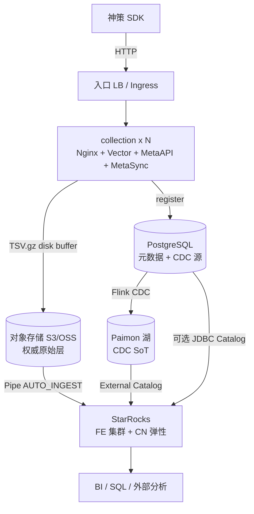

# 埋点数据全链路：生产级 Lakehouse 架构设计

> **文档角色：** 本仓架构设计真源（目标态 + 演进路径）。  
> **运行时真源：** 根 `README.md`、`services/`、`docker-compose.yml`、`deploy/k8s/`、`AGENTS.md`。  
> **冲突裁决：** 实现细节以代码为准；目标态与差距以本文 + `docs/product/gap-register.md` 为准。  
> **版本：** 2026-08（对齐双链路运行时；HA / 性能 / 成本；补齐 Kafka / 解析栈 / Meta 降级 ADR）

---

## 0. 设计目标与约束

### 0.1 目标

| 维度 | 目标（生产） | 实验室现状 |
|------|--------------|------------|
| 规模 | 埋点 ≤ **1 TB/天** 原始入站；峰值 ≈ 日均 × **5** | 本地 Compose / 单 NS 冒烟 |
| 新鲜度 | S3 durable ≤ **2 min**；仓内可查 ≤ **5 min**（P95） | Vector batch 60s + Pipe poll 30s |
| 可用性 | 采集入口 **99.9%**；查询面 **99.5%** | 多数控制面单副本 |
| 成本 | 单位 GB 入站与查询成本可控；冷热分层默认开启 | HPA 基线偏高、自建 MinIO |
| 范围 | 埋点采集 + 对象缓冲 + 数仓；CDC 入湖可选增强 | 双链路均已打通 |

### 0.2 非目标（本期不做）

- 面向终端用户的分析产品 UI  
- AI 对账门 / LLM 质量闸 / DataSage / Paperclip  
- 秒级实时看板（需另开短链路；本方案默认分钟级分析）  
- **默认引入 Kafka / Pulsar 等消息总线**（削峰与重放由 Vector disk buffer + S3 承担，见 ADR-7）  
- **为追求吞吐重写采集解析语言**（Go/Java/Python 自研解析服务；见 ADR-8）  

### 0.3 权威副本（Source of Truth）决策

| 数据 | 权威副本 | 说明 |
|------|----------|------|
| 埋点原始事件 | **S3 对象** `s3://…/track/events/dt=/hour=/*.tsv.gz` | 可重放进仓；Pipe 失败可按前缀回补 |
| 埋点分析表 | StarRocks `ods.ods_events`（shared_data） | 查询主路径；**非**唯一权威 |
| CDC 业务表 | **Paimon**（经 Flink CDC） | 支持 PK upsert / Time Travel |
| 埋点元数据（项目/事件/属性） | PostgreSQL `stellar_trace` | MetaAPI 写入；Vector enrichment CSV 为缓存 |

**明确不采用：** 埋点同步经 Flink 写入 Paimon 再挂 Catalog 作为主路径（成本高、延迟叠加、运维面大）。若未来需要多引擎重算，走「可选异步入湖」旁路，不挡采集。

---

## 1. 逻辑架构

### 1.1 总览



### 1.2 双链路职责

| 链路 | 路径 | 职责 |
|------|------|------|
| **埋点** | SDK → collection → S3(`TSV.gz`) → StarRocks Pipe → `ods_*` / MV / TASK | 高吞吐采集、分钟级可查、低固定成本 |
| **CDC** | PostgreSQL → Flink CDC → Paimon → StarRocks Paimon Catalog | 维度/业务表近实时、可重放、schema 演进 |

### 1.3 部署拓扑分层

| 层 | 实验室（已实现） | 生产目标态 |
|----|------------------|------------|
| 入口 | Compose scale / K8s Deployment+HPA | 多 AZ LB + PDB；minReplicas 跨 AZ ≥ 2 |
| 对象存储 | MinIO（Compose 单机 / K8s 4 节点） | **托管 S3/OSS 多 AZ**；Lifecycle |
| 元数据 DB | Postgres 单实例 | 托管多 AZ RDS / Patroni + WAL 归档 |
| 分析 | FE×1 + CN×2~3 | FE≥3；CN 按查询弹性；DataCache=本地盘 70–80% |
| CDC | Compose 单 JM/TM；**K8s 未部署** | JM HA + S3 checkpoint；TM≥2；HMS HA 或托管 Catalog |

---

## 2. 组件选型与版本

| 组件 | 版本（运行时） | 角色 | 生产备注 |
|------|----------------|------|----------|
| Nginx | 1.27 | HTTP 入口、神策协议接入、健康检查 | 限流 / 连接超时 / access JSON |
| Vector | 0.53 | 解码、UA/GeoIP、分级、TSV 落盘缓冲、写 S3 | buffer 必须 PVC；禁止仅 emptyDir |
| MetaAPI / MetaSync | 仓内 | 事件/属性注册与 enrichment CSV 同步 | 连接池上限；全局限流防打爆 PG |
| PostgreSQL | 16 | 元数据 + CDC 源（`wal_level=logical`） | 多 AZ；slot 监控 |
| MinIO / S3 | — | 原始事件、Paimon warehouse、SR shared_data | 生产用托管对象存储 |
| StarRocks | 3.5.x | 存算分离 FE+CN；Pipe；MV；Paimon Catalog | FE 多副本；`replication_num=1`（数据在对象存储） |
| Flink | 1.20.x | **仅 CDC** → Paimon | 不进埋点主路径 |
| Paimon | 1.3.x | CDC 湖表 | Hive Metastore 或后续 Rest Catalog |
| Hive Metastore | 3.1.3 | Paimon 元数据 | PG 后端；生产多实例或替代方案 |

---

## 3. 埋点链路设计

### 3.1 采集节点（collection）

单 Pod / 容器内进程：

1. **Nginx**：接收神策 POST/GET；写 JSON access log；`/health`  
2. **Vector**：读日志 → 协议解码 → enrichment → 格式化为 TSV → **disk buffer** → S3  
3. **MetaAPI**：新事件/属性注册到 PG  
4. **MetaSync**：周期性把 PG 白名单/schema 刷到本地 CSV，供 Vector enrichment

水平扩展：无会话粘滞要求；**每个实例独立 disk buffer**（不可共享 RWX 缓冲目录）。

### 3.2 S3 布局

```text
s3://{bucket}/
  track/events/dt={YYYY-MM-DD}/hour={HH}/{uuid}.tsv.gz
  track/id_mapping/dt={YYYY-MM-DD}/hour={HH}/{uuid}.tsv.gz
  paimon_data/                          # CDC / Paimon warehouse
  starrocks/                            # shared_data 持久化（FE 配置 path）
```

**events TSV 列序（11 列，tab）：**  
`event_time, distinct_id, login_id, anonymous_id, original_id, event, type, project, properties, event_group, dt`

### 3.3 Vector 生产参数（目标）

| 参数 | 建议 | 理由 |
|------|------|------|
| `batch.max_bytes` | 32–64 MB | 降 PutObject；过大增加可见延迟 |
| `batch.timeout_secs` | 30–60 | 与「仓内 ≤5 min」预算对齐 |
| `buffer.type` | disk | 下游抖动不丢 |
| `buffer.max_size` | ≥ 20–50 GB/实例（PVC） | 按峰值积压窗口估算 |
| `when_full` | `block` | 背压到 Nginx；配合入口限流与扩容 |
| compression | gzip | 带宽与存储成本 |

实验室默认见 `services/collection/config/vector.yaml`（10GB events buffer 等），生产按上表上调并挂 PVC。

### 3.4 消息队列（Kafka 等）— 默认不上

主路径 **不** 插入 Kafka。等价能力对照：

| 能力 | 本方案替代 | Kafka 才值得上的触发条件 |
|------|------------|--------------------------|
| 削峰 | Vector disk buffer + `when_full: block` + HPA | 多下游必须同时实时消费同一份流 |
| 解耦 | S3 对象为权威层；Pipe / 批作业按需读 | 强依赖 consumer group / 多订阅者 |
| 重放 | S3 前缀回补 / `INSERT FROM FILES` | 需要按 offset 的流式重放语义 |
| 近实时 | 分钟级 Pipe 足够 | 产品明确要求秒级短链路（另开，不替换 Pipe） |

**不上的理由：** 与 S3 SoT 功能重叠；增加集群 HA、磁盘与消费滞后运维面；抬高固定成本。  
**若未来满足触发条件：** 作为旁路「实时短链路」增量引入，**不得**阻挡 Vector→S3 主路径（见 Phase P3）。

### 3.5 日志解析栈 — 继续 Vector / VRL

| 项 | 结论 |
|----|------|
| 现状 | Nginx access → Vector remap（约 7 步）：协议解码 → unnest → GeoIP/ enrichment → UA 归一 → TSV |
| 效率判断 | 神策 base64±gzip+JSON 是协议必要成本；Vector（Rust）+ VRL 匹配该负载；瓶颈更常在 S3/Pipe 而非 remap CPU |
| 优化优先 | 早过滤 DEBUG/无效事件；控制巨包；压测区分 CPU vs sink；再谈改栈 |
| **不换语言** | 不以「感觉更快」换成 Go/Java/Python/OpenResty 自研解析 |

**换语言触发条件（须同时满足，见 ADR-8）：**

1. 压测证明 Vector CPU 持续偏高，且 sink（S3）仍有余量  
2. 减 transform / 早 drop 后仍不达标  
3. HPA 已到成本墙，单位事件 CPU 仍不满足目标  

未满足前禁止换栈重写。

### 3.6 StarRocks Pipe

- `ods.pipe_s3_events` / `ods.pipe_s3_id_mapping`：`AUTO_INGEST=TRUE`，poll ≈ 30s  
- 失败处置：保留 S3 对象；修 PIPE / 权限后按前缀重挂或手工 `INSERT FROM FILES`  
- **不要**依赖 Pipe 状态作为唯一审计；以 S3 清单 + 仓内行数为准

### 3.7 仓内模型（摘要）

| 对象 | 模型 | 要点 |
|------|------|------|
| `ods.ods_events` | DUPLICATE KEY `(dt,event,event_group,project)` + HASH(`distinct_id`) | 动态分区、ZSTD、Bloom、生成列、DataCache 热 30 天 |
| `ods.ods_id_mapping` | DUPLICATE + 索引 | 身份映射 |
| `ods.dws_daily_event_stats` | 异步 MV | 10 min；`partition_refresh_number` 防雪崩 |
| `ods.dwd_users` | PRIMARY KEY + SCHEDULED TASK | 近窗口增量 UPSERT |

生命周期：`event_group` 分级保留（如 CORE 365d / TRACE 180d / DEBUG 30d）；超期分区删除 + S3 Lifecycle 双轨。

---

## 4. CDC 链路设计

### 4.1 路径

PostgreSQL（logical replication）→ Flink CDC（exactly-once checkpoint）→ Paimon PK 表 → StarRocks Paimon External Catalog。

实验室示例：`cdc_test.cdc_test_orders` → `paimon_hms.ods.ods_orders_cdc`（见 `services/flink/flink.sql`）。

### 4.2 生产要求

| 项 | 要求 |
|----|------|
| JobManager | HA（ZK/K8s）；元数据外置 |
| Checkpoint | 存托管 S3；间隔与状态 TTL 按表设定 |
| TaskManager | ≥ 2；并行度按表吞吐 |
| Slot / 延迟 | 监控 replication slot lag；防 disk full |
| Catalog | HMS 多实例或迁移 Rest/JDBC Catalog，避免单点 |

### 4.3 何时启用 CDC

- **需要**：业务维表近实时、PK 更新语义、跨引擎读湖、监管重放  
- **可不启用 / 批式代替**：变更极少、可接受 T+1 JDBC/`INSERT`；以降低 Flink+HMS 固定成本

---

## 5. 高可用设计

### 5.1 可用性与数据目标

| 对象 | RPO | RTO | 手段 |
|------|-----|-----|------|
| 已写入 S3 的埋点对象 | ≈ 0（对象存储耐久） | 依赖区域恢复 | 多 AZ bucket；版本/跨区按合规 |
| Vector 缓冲中未 flush | **有损窗口** = 实例本地盘 | 分钟～数十分钟 | PVC + PDB；禁止 emptyDir 生产 |
| StarRocks 查询 | 元数据依赖 FE | FE 故障切换分钟级 | FE≥3；CN 无状态可重建 |
| PG 元数据 | 秒～分钟（同步副本） | 分钟级切换 | 多 AZ；PITR |
| CDC | checkpoint 间隔内 | Job 恢复时间 | Flink HA + 外置 checkpoint |

### 5.2 组件 HA 清单

| 组件 | 最低生产配置 | 反模式（当前实验室常见） |
|------|--------------|--------------------------|
| collection | ≥2 AZ，HPA min=2~3，max 按压测；**PVC disk buffer**；PDB | minReplicas=6 空烧；emptyDir buffer |
| 对象存储 | 托管多 AZ；IAM 最小权限 | 自建 MinIO 当生产 SoT |
| StarRocks FE | 3 节点跨 AZ；客户端连 FE LB | FE replicas=1 |
| StarRocks CN | ≥3；可缩容；cache 盘本地 SSD | cache limit 10GB vs 200Gi PVC 错配 |
| PostgreSQL | 多 AZ + 备份 | 单 StatefulSet |
| Flink / HMS | HA + 进正式编排 | 仅 Compose；K8s 清单缺失 |

### 5.3 故障域与降级

```text
S3 短暂不可用 → Vector disk buffer 积压 → 入口 block/429 → HPA 扩容无效时需告警人工
FE 不可用       → 查询与 Pipe 暂停；采集仍可写 S3（权威层仍在）
CN 不足         → 查询变慢；扩 CN；不影响采集
PG 不可用       → Meta 降级按 ADR-9：采集放行；注册可丢最新； enrichment 用上次 CSV
Flink 不可用    → CDC 暂停；埋点链路不受影响
```

**ADR-9（已拍板）：** Meta/PG 故障时 **fail-open**——埋点采集与写 S3 继续；`to_meta_api` 允许 `drop_newest` / 异步重试；Vector enrichment 使用 MetaSync 上次成功的 CSV。不以拒收换元数据强一致。

---

## 6. 高性能设计

### 6.1 原则

1. **重逻辑前置**：解码 / UA / GeoIP / 分级在 Vector，仓内少做 JSON 爆炸解析（生成列已固化常用维）。  
2. **批量与分区**：小时前缀 + 大 batch；查询必带 `dt`。  
3. **热数据本地化**：CN DataCache；`datacache.partition_duration` 与业务热窗一致（默认 30 天）。  
4. **读写隔离**：Resource Group / 限流；ETL Pipe 与 ad-hoc 查询分队列。

### 6.2 DataCache 校准（强制）

| 环境 | 本地 cache 盘 | `starlet_cache_limit_gb` |
|------|---------------|--------------------------|
| 实验室 Compose | 小盘 | 10 可接受 |
| 生产 | PVC/本地 NVMe 例 200–500 Gi | **设为盘容量的 70–80%**，禁止长期 10GB 默认 |

扩容 CN 后依赖 `enable_shared_data_mode_warmup` 预热，避免首查全打对象存储。

### 6.3 容量粗算（1 TB/天 原始）

假设 gzip 后 ≈ 0.2–0.35× → 约 **200–350 GB/天** 对象增量。

| 项 | 粗算 |
|----|------|
| 热 30 天对象 | ≈ 6–10 TB（未计多版本） |
| CN cache | 按「日查询扫描热集」定，通常数 TB 级集群合计，而非单机 10GB |
| FE | CPU/内存随 tablet 元数据与并发；3 节点起步，按慢查与 FE 指标扩 |
| collection | 按峰值 HTTP QPS 与 Vector CPU；用压测定 HPA，忌拍脑袋 min=6 |

压测入口：`make bench`（实验室）；生产前补正式报告进 `docs/ops/`。

### 6.4 新鲜度预算

```text
SDK → Nginx ACK          : 毫秒～数十毫秒
Vector batch/flush → S3  : ≤ 60s（可调）
Pipe poll + ingest       : ≤ 30–120s
MV / dwd TASK            : +10 min 量级（衍生表）
────────────────────────────────
ods_events 可查 P95      : ≤ 5 min（目标）
```

---

## 7. 低成本设计

### 7.1 已采纳的降本结构

- 埋点 **不经 Flink/Paimon** → 去掉常驻流计算与双写湖仓  
- StarRocks **shared_data + replication_num=1** → 计算与存储解耦，本地只 cache  
- TSV.gz 简单落盘 → 实现与运维成本低于「采集侧直接 Parquet+入湖」

### 7.2 成本控制清单

| 杠杆 | 做法 |
|------|------|
| 计算弹性 | HPA：低峰 minReplicas=2~3；CN 按查询队列扩缩 |
| 存储分层 | S3 Standard（热）→ IA/归档；分区 TTL 与 Lifecycle 对齐 `event_group` |
| 固定成本 | CDC 按需启停或批式；避免空转 Flink |
| 运维人力 | 托管 S3 / 托管 PG；少运自建 MinIO/单机 PG |
| 查询成本 | MV/预聚合服务看板；禁无分区全表扫；限并发 |

### 7.3 成本反模式

- 全年 FE×1「先上线再 HA」→ 故障成本远高于 2 台 Follower  
- cache 配 10GB 导致反复读 S3 → **流量费 + 延迟**双杀  
- 为「理论完美湖仓」强制埋点走 Paimon → 固定成本上升，收益有限  

---

## 8. 安全与合规（基线）

- 密钥：K8s Secret / 云 IAM；禁止默认 `minioadmin` 进生产  
- 网络：采集入口公网；FE/PG/MinIO 仅内网；最小安全组  
- 隐私：IP/Geo、distinct_id 按合规脱敏或访问控制；审计查询账号  
- 供应链：镜像固定 digest；GeoIP 数据内网分发（避免每 Pod 冷启下载）

---

## 9. 可观测与验收

### 9.1 黄金指标

| 层 | 指标 | 告警建议 |
|----|------|----------|
| 入口 | QPS、5xx、延迟、限流次数 | 5xx↑ / 延迟 P99↑ |
| Vector | buffer 使用率、sink 错误、flush 延迟 | buffer > 70%；错误率 > 1% |
| S3 | Put 失败、4xx/5xx | 持续失败 |
| Pipe | lag（未 ingest 文件年龄）、错误 | lag > 10 min |
| FE/CN | 慢查、CN 存活、datacache hit | hit < 目标；CN 掉线 |
| PG | 连接数、复制延迟、slot lag | slot lag 磁盘风险 |
| Flink | checkpoint 失败、反压 | 连续失败 |

### 9.2 验收门槛

| 阶段 | 门槛 |
|------|------|
| 实验室 | `make verify`；CDC 用例可查 Catalog |
| 预发 | 压测报告；FE≥3 演练；杀 Vector Pod 验证 PVC 不丢（或可接受 RPO） |
| 生产 | 监控告警就绪；备份/回补演练；Deploy 轨批准（P4） |

---

## 10. 与仓库映射

| 设计块 | 代码 / 配置 |
|--------|-------------|
| 采集 | `services/collection/`、`deploy/k8s/collection-deployment.yaml`、`hpa-collection.yaml` |
| Vector | `services/collection/config/vector.yaml`、`deploy/k8s/configmap-vector.yaml` |
| Pipe / 仓表 | `services/starrocks/starrocks.sql`、`starrocks-pipes.sql` |
| FE/CN 配置 | `services/starrocks/config/fe-shared.conf`、`cn.conf` |
| CDC | `services/flink/flink.sql`、`services/hive/` |
| Compose | `docker-compose.yml` |
| K8s | `deploy/k8s/`（当前缺 Flink/HMS） |
| 产品边界 | `docs/product/PRODUCT.md`、`foundation/mission.md` |
| 差距 | `docs/product/gap-register.md` |

---

## 11. 演进路线

### Phase L — 实验室（当前）

- Compose 双链路打通；K8s 采集 + MinIO + PG + SR  
- 文档与代码双链路叙事一致（本文）

### Phase P0 — 生产最低可上线（埋点主路径）

1. 托管多 AZ 对象存储替换生产 MinIO SoT  
2. StarRocks FE≥3；修正 CN DataCache limit  
3. collection：PVC buffer + PDB；HPA 基线降本  
4. PG 多 AZ + 备份  
5. 黄金指标监控与 Pipe/S3 回补手册  

### Phase P1 — 稳妥运行

6. 入口限流与多 AZ；GeoIP/镜像内网化  
7. S3 Lifecycle + event_group 保留策略落地  
8. Resource Group；MV/TASK 调优；正式压测报告  

### Phase P2 — CDC 生产化（可选）

9. Flink/HMS（或替代 Catalog）进 K8s/编排并 HA  
10. slot/checkpoint 告警与演练  

### Phase P3 — 可选增强

11. 埋点异步入湖旁路（S3 → 批/流写 Paimon）供多引擎，**不**改采集主路径  
12. 近实时短链路（仅产品明确要求秒级时；可评估 Kafka，仍不替换 Vector→S3）  
13. 自研解析服务（仅 ADR-8 触发条件全部满足后）

---

## 12. 决策记录（ADR 摘要）

| ID | 决策 | 理由 |
|----|------|------|
| ADR-1 | 埋点主路径 = S3 + Pipe，不经 Flink/Paimon | 降固定成本；分钟级分析足够；S3 可重放 |
| ADR-2 | 埋点权威副本 = S3 对象 | 仓可重建；与 FE 故障解耦 |
| ADR-3 | CDC 走 Paimon | PK/Time Travel；与埋点路径隔离故障域 |
| ADR-4 | StarRocks shared_data + replication_num=1 | 存算分离；耐久交给对象存储 |
| ADR-5 | 生产对象存储用托管云，不用自建 MinIO | HA/耐久/人力成本 |
| ADR-6 | Vector 生产缓冲必须 PVC | emptyDir 在驱逐时丢未 flush 数据 |
| ADR-7 | **默认不上 Kafka**；削峰/重放用 Vector buffer + S3 | 与 SoT 重叠；固定成本高；多下游实时流再评估旁路 |
| ADR-8 | **采集解析以 Vector/VRL 为准**；不因性能焦虑换语言 | 协议成本不可避免；换栈门槛见 §3.5 |
| ADR-9 | Meta/PG 故障 **fail-open**：采集放行，注册可降级 | 优先保证事件落 S3；元数据最终一致 |

---

## 13. 落地 Checklist（对照代码）

- [x] 双链路在 Compose 可验证（`make verify` / Flink CDC）  
- [x] 仓表 / Pipe / MV / dwd TASK 脚本齐备  
- [x] Kafka / 解析栈 / Meta 降级 ADR 成文（ADR-7/8/9）  
- [ ] 架构文档与运行时持续对齐  
- [ ] K8s：FE 多副本、Vector PVC、Flink/HMS 清单  
- [ ] DataCache limit 与盘对齐  
- [ ] 托管 S3/PG 与密钥治理  
- [ ] 统一可观测与告警  
- [ ] 压测与故障演练记录  

---

*维护：变更主路径、SoT、消息队列或解析栈时同步更新本文 §0.2–0.3、§3.4–3.5、§11–12 与 `gap-register.md`。*
