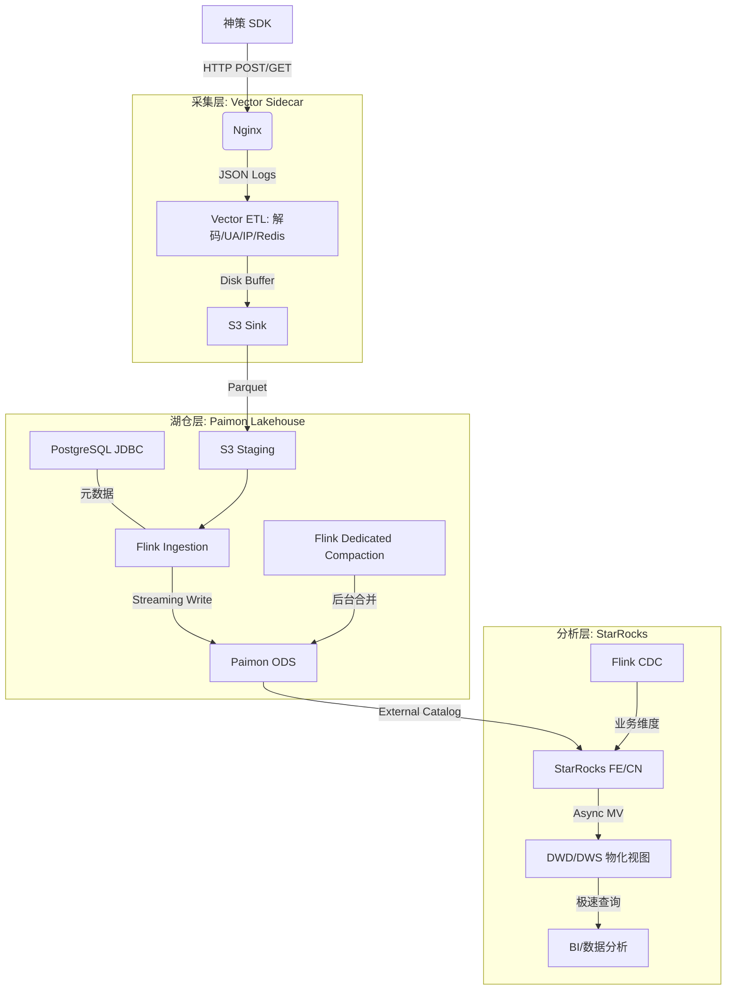

# 埋点数据全链路方案：生产级 Lakehouse 架构设计

本文档定义了一套基于 2026 年前沿 Lakehouse 技术的埋点数据全链路方案。本方案针对 **神策数据 (Sensors Data) SDK** 进行了深度适配，通过 **Vector (采集) + Paimon (湖仓) + StarRocks (极速分析)** 的组合，实现 1TB/天规模下的高可靠、低成本、高性能数据处理。

---

## 一、 架构总览

### 1.1 逻辑架构图


### 1.2 核心设计理念
1.  **神策协议适配**：深度解析神策 SDK 的 Base64 编码协议，支持 `track`、`profile` 等多种数据类型。
2.  **增强 ETL 链路**：在采集端完成 UA 解析、GeoIP 转换及 Redis 元数据校验，减轻下游计算压力。
3.  **湖仓一体**：埋点 ODS 统一存储在 Paimon 湖，支持 Schema 演进和多引擎访问。
4.  **极简元数据**：使用 PostgreSQL 替代 Hive，降低运维复杂度，提升元数据并发能力。
5.  **分级治理**：按 `event_group` 物理拆分存储，实现精细化的生命周期管理。

## 二、 架构选型深度解析

### 2.1 为什么保留 Paimon 与 Flink？
在 1TB/天规模下，去掉这两个组件虽然能简化架构，但会丧失以下核心生产能力：
1.  **数据湖“后悔药” (Time Travel)**：Paimon 作为 Source of Truth，支持数据重放。若 StarRocks 逻辑错误或集群损坏，可随时从湖中重算。
2.  **抗峰值缓冲**：Vector 将数据推入 S3 Staging，Flink 异步平滑摄取。避免了 5 倍峰值直冲 StarRocks FE 导致的查询阻塞。
3.  **Schema 灵活性**：埋点字段变动极快，Paimon 的 LSM-Tree 结构处理加字段几乎零成本，而 StarRocks 强 Schema 约束在大数据量下 ALTER 成本极高。

### 2.3 双重“存算分离”架构
*   **Paimon 存算分离 (ODS 层)**：负责高频、大吞吐的原始日志写入。利用 S3 的廉价存储和 Flink 的流处理能力，解决 IO 瓶颈并平滑成本。
*   **StarRocks 存算分离 (DWD/DWS 层)**：负责高性能查询。数据存在 S3，本地 NVMe 做 Cache。通过异步物化视图将湖中数据“提纯”到仓内，实现秒级分析。

---

## 三、 组件版本与依赖

### 2.1 核心组件清单
| 组件 | 版本 | 关键特性 |
|------|------|----------|
| **Flink** | 1.18 | 支持流批一体，完善的 Paimon 1.2 适配 |
| **Paimon** | 1.2.x | JDBC Catalog, Partition Expiration, Dedicated Compaction |
| **StarRocks** | ≥ 3.1 | Paimon JDBC Catalog 挂载, 异步物化视图 (MV) |
| **PostgreSQL** | 15+ | 替代 Hive 作为元数据中心 |
| **Vector** | 0.35+ | 物理磁盘缓冲, Parquet 编码 |
| **Redis** | 7.0+ | 用于采集端元数据高速校验 |

---

## 四、 数据定义 (Schema)

### 3.1 神策协议字段映射
| 字段 | 类型 | 来源 | 说明 |
|------|------|------|----------|
| `time` | TIMESTAMP | 神策 SDK | 事件发生时间 (毫秒转时间戳) |
| `distinct_id` | STRING | 神策 SDK | 用户唯一标识 |
| `event` | STRING | 神策 SDK | 事件名称 |
| `type` | STRING | 神策 SDK | 数据类型 (track/profile_set等) |
| `properties` | JSON | 神策 SDK | 事件属性集合 |
| `project` | STRING | 神策 SDK | 项目名称 |
| `ua_browser` | STRING | Vector | 解析后的浏览器名称 |
| `ua_os` | STRING | Vector | 解析后的操作系统 |
| `geoip` | JSON | Vector | 解析后的地理位置信息 |
| `redis_meta` | STRING | Vector | 从 Redis 查询到的元数据 |
| `event_group`| STRING | Vector | 业务分级 (根据 event 映射) |
| `is_valid` | BOOLEAN | Vector | 校验协议格式及 Redis 白名单 |
| `dt` | STRING | Flink | 分区字段 (YYYY-MM-DD) |

### 3.2 Nginx 日志格式 (适配神策 + 增强捕获)
```nginx
log_format json_combined escape=json '{'
    '"time":"$time_iso8601",'
    '"remote_addr":"$remote_addr",'
    '"http_user_agent":"$http_user_agent",'
    '"method":"$request_method",'
    '"uri":"$uri",'
    '"sa_data":"$arg_data",'
    '"status":$status'
'}';
```

---

## 五、 采集与入湖实现

### 4.1 Vector 生产配置 (增强 ETL 逻辑)
Vector 负责解码、UA 解析、GeoIP 转换及 Redis 元数据校验：

```yaml
transforms:
  # 1. 神策协议解码 + UA 解析
  sa_decode:
    type: "remap"
    inputs: ["nginx_logs"]
    source: |
      . = parse_json!(.message)
      # 解析 User-Agent
      if exists(.http_user_agent) {
          ua, err = parse_user_agent(.http_user_agent)
          if err == null {
              .ua_browser = ua.browser.name
              .ua_os = ua.os.name
          }
      }
      # 解码神策数据
      if exists(.sa_data) {
          decoded = decode_base64!(.sa_data)
          sa = parse_json!(decoded)
          .distinct_id = sa.distinct_id
          .event = sa.event
          .properties = encode_json(sa.properties)
          .time = to_timestamp!(sa.time, "milliseconds")
          # 业务分级
          .event_group = if match(string!(.event), r'^(\$|debug_)') { "DEBUG" } else { "CORE" }
          .is_valid = true
      }

  # 2. IP 解析 (GeoIP)
  ip_geoip:
    type: "geoip"
    inputs: ["sa_decode"]
    database: "/var/lib/vector/GeoLite2-City.mmdb"
    source: "remote_addr"
    target: "geoip"

  # 3. Redis 元数据校验
  redis_check:
    type: "redis"
    inputs: ["ip_geoip"]
    url: "redis://redis:6379/0"
    lookup: { key: "user_whitelist:{{distinct_id}}", target: "redis_meta" }

  # 4. 最终校验
  final_check:
    type: "remap"
    inputs: ["redis_check"]
    source: |
      if .event_group != "DEBUG" && .redis_meta == null {
          .is_valid = false
      }

sinks:
  to_s3:
    type: "aws_s3"
    inputs: ["final_check"]
    bucket: "paimon-lake"
    key_prefix: "staging/dt={{ format_timestamp!(now(), \"%Y-%m-%d\") }}/"
    encoding: { codec: "parquet" }
    buffer:
      type: "disk"
      max_size: 107374182400 # 100GB 磁盘缓冲
      when_full: "block"
    batch:
      max_bytes: 104857600    # 100MB 批次上传
```

### 4.2 Paimon 湖仓建模 (增强 Schema)
```sql
-- CORE 表 (增加 UA/IP/Redis 字段)
CREATE TABLE ods_events_core (
    `time` TIMESTAMP(3),
    distinct_id STRING,
    `event` STRING,
    `properties` STRING,
    ua_browser STRING,
    ua_os STRING,
    geoip STRING, -- 存储为 JSON 字符串
    redis_meta STRING,
    remote_addr STRING,
    event_group STRING
) PARTITIONED BY (dt STRING) WITH ('bucket' = '4');
```

---

## 六、 分析层加速 (StarRocks)

### 5.1 性能优化配置
1.  **开启本地缓存**：在 CN 节点配置 `storage_root_path` 为 NVMe SSD 路径。
2.  **配置 Data Cache**：
    ```sql
    SET GLOBAL enable_scan_datacache = true;
    ```

### 5.2 物化视图建模
```sql
-- DWD 层：关联业务维度
CREATE MATERIALIZED VIEW dwd_user_full_track
REFRESH ASYNCHRONOUS EVERY (INTERVAL 10 MINUTE)
AS
SELECT 
    e.`time`, e.`event`, e.ua_browser, e.ua_os,
    m.id_int, o.order_id
FROM paimon_catalog.default.ods_events_core e
JOIN dim_user_mapping m ON e.distinct_id = m.user_id
LEFT JOIN dim_orders o ON e.distinct_id = o.user_id 
     AND ABS(TIMESTAMPDIFF(SECOND, e.`time`, o.created_at)) < 3600;
```

---

## 七、 生产运维与治理

### 6.1 关键监控指标
| 组件 | 核心指标 | 告警阈值 |
|------|----------|----------|
| **Vector** | `buffer_file_size` | > 80GB (下游阻塞) |
| **Redis** | `lookup_error_rate` | > 1% (校验服务异常) |
| **Paimon** | `snapshot_count` | > 1000 (过期策略失效) |
| **StarRocks**| `datacache_hit_rate` | < 85% (缓存未命中) |

---

## 八、 落地 Checklist
1.  [ ] **Phase 0**: 准备 Flink lib 依赖，下载 GeoLite2-City.mmdb。
2.  [ ] **Phase 1**: 部署 Redis 并导入用户白名单/元数据。
3.  [ ] **Phase 2**: 提交 Flink 入湖 Job，确保 `is_valid=true` 的数据写入 CORE 表。
4.  [ ] **Phase 3**: 配置 StarRocks 开启 Data Cache。

---

*文档版本：2026-02 (增强 ETL 架构版)*
